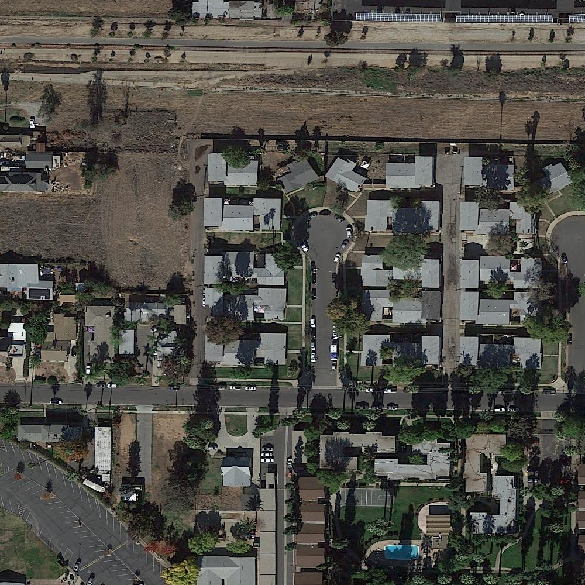
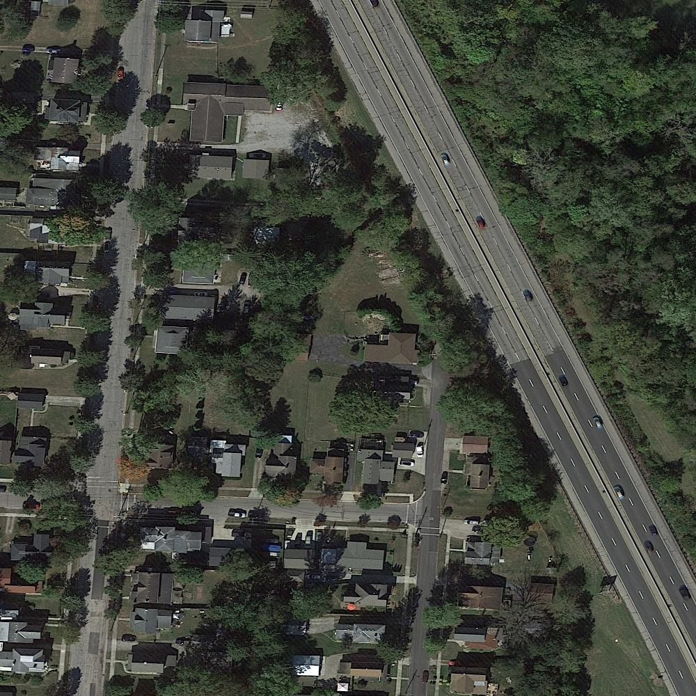
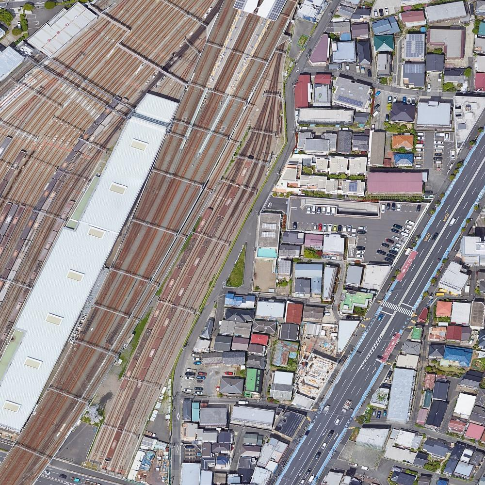
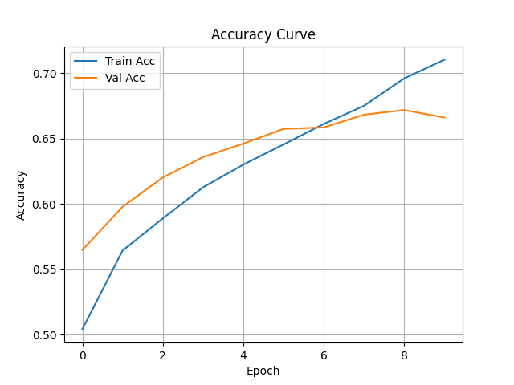
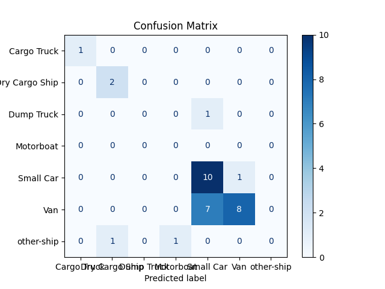
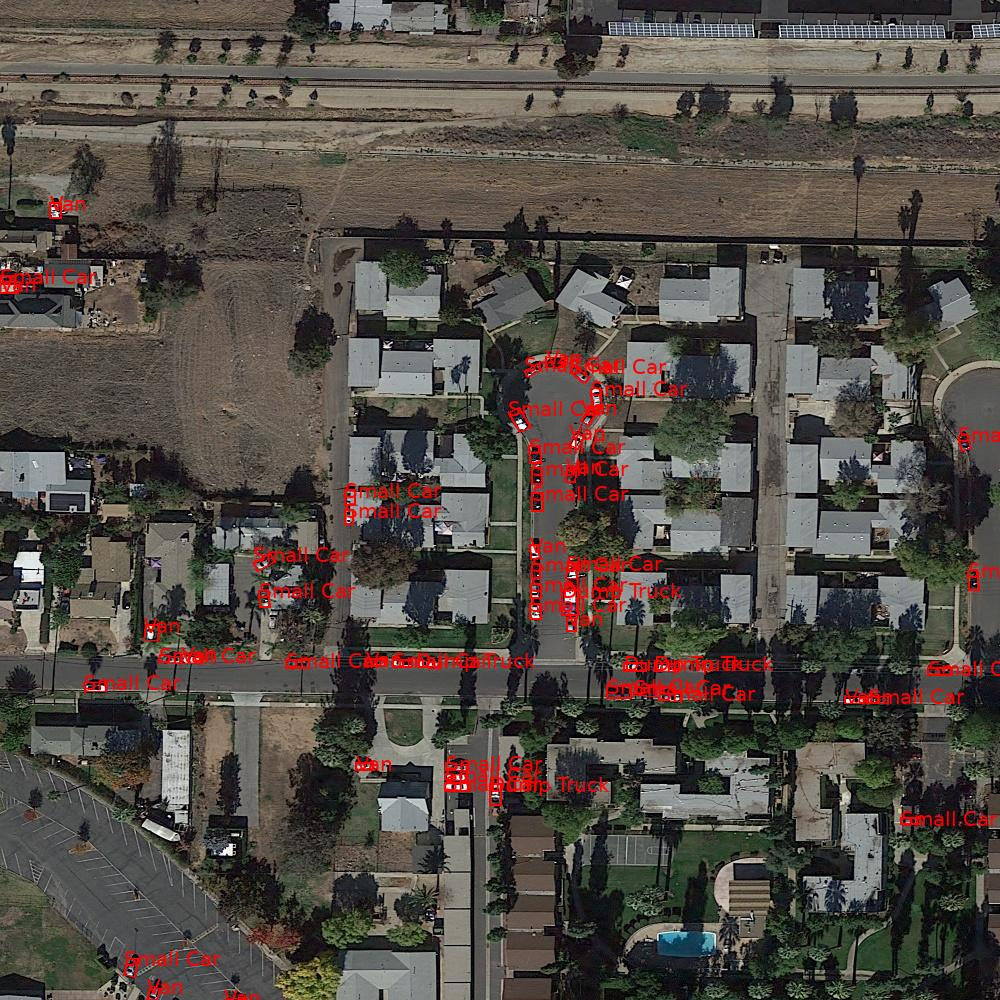
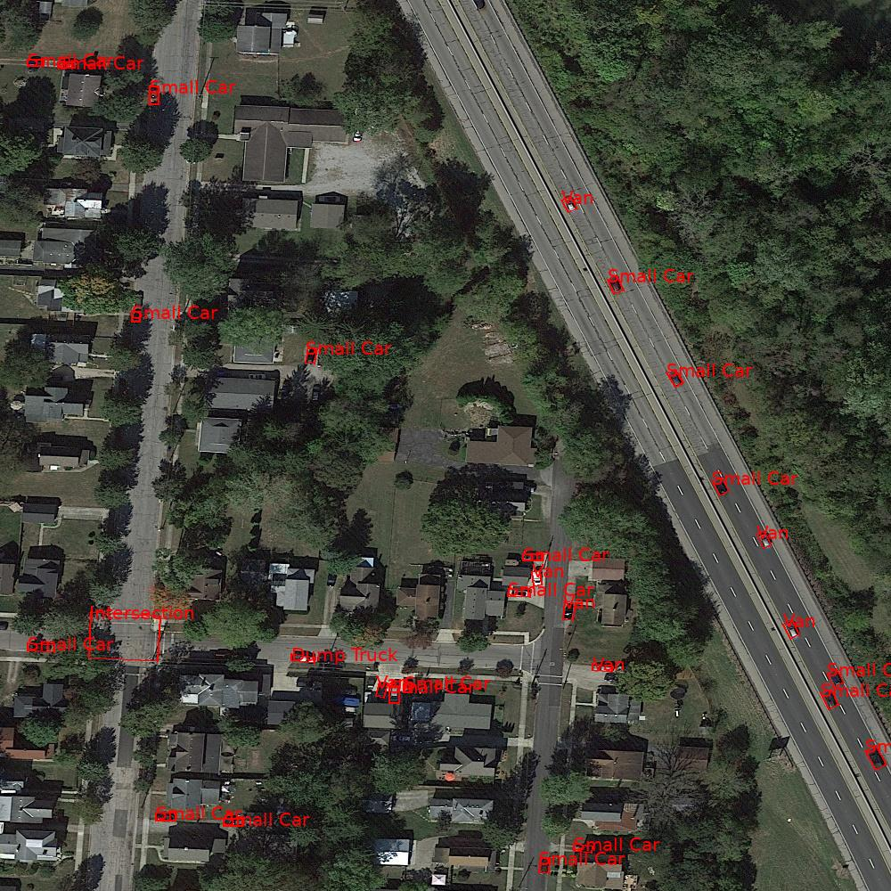
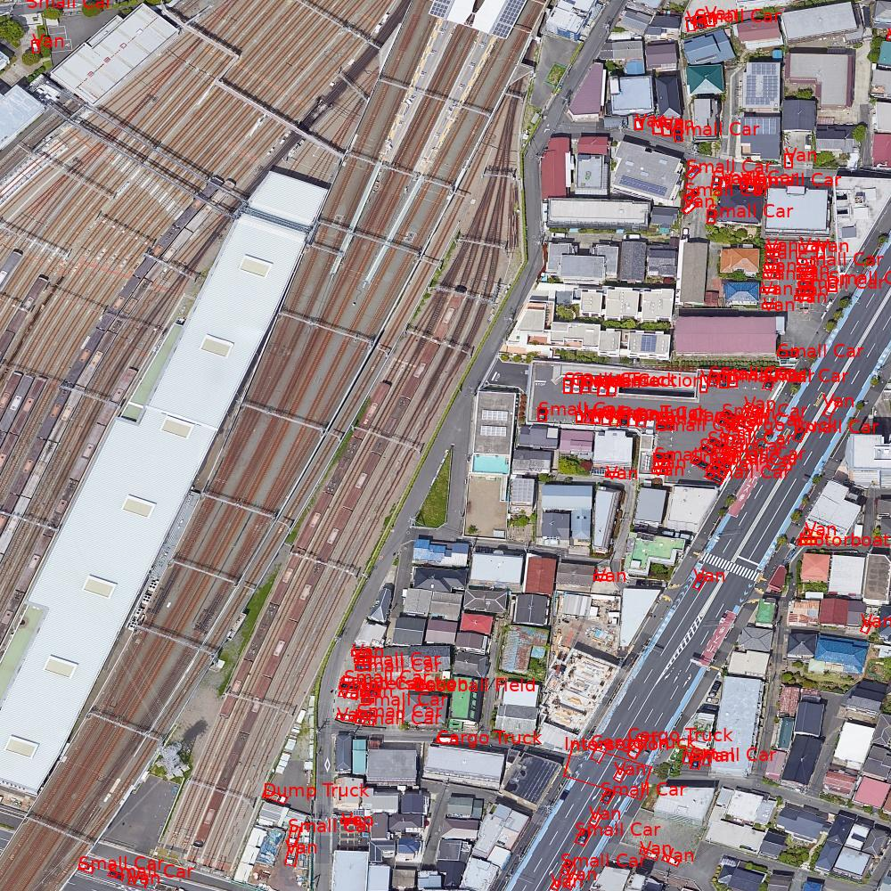

# FAIR1M-CNN-ObjectRecognition

🚀 A memory-efficient deep learning pipeline for fine-grained object recognition on the FAIR1M satellite dataset using a custom Keras data generator and lightweight CNN architecture.

---

## 📌 Project Overview

This project addresses the challenge of recognizing fine-grained objects in high-resolution satellite imagery using the **FAIR1M dataset**. It implements a **custom Keras data generator** to train a **CNN model** on modest hardware by dynamically loading image patches.

### 🔍 Key Features
- Custom `FAIR1MGenerator` for batch-wise TIFF+XML parsing
- Lightweight CNN with 71.04% training and 66.61% validation accuracy
- Full memory-efficient pipeline (runs on CPU-only machines)
- Annotated prediction visualizations and confusion matrix

---

## 🧠 Model Architecture

The CNN uses 3 convolutional layers with increasing filter depth, followed by a dense layer and dropout for regularization.

```
Input (224x224x3)
→ Conv2D (32 filters) + ReLU + MaxPooling
→ Conv2D (64 filters) + ReLU + MaxPooling
→ Conv2D (128 filters) + ReLU + MaxPooling
→ Flatten → Dense(128) + ReLU → Dropout(0.5)
→ Dense(37) + Softmax
```

---

## 🗂 Dataset: FAIR1M

- Source: [FAIR1M on Hugging Face](https://huggingface.co/papers/2103.05569)
- 15,000 high-resolution TIFF images
- Over 1 million object annotations across 37 subcategories

### 🖼️ FAIR1M Sample Images





---

## 📈 Results

### 🎯 Accuracy
- **Training Accuracy**: 71.04%
- **Validation Accuracy**: 66.61%

### 📊 Accuracy Curve



### 🔁 Confusion Matrix



### 📸 Predicted Output Visualizations





---

## 📚 References

- Lin, D. et al., FAIR1M Dataset IEEE TGRS, 2021
- Chollet, F. et al., Keras Library, GitHub, 2015
- Redmon, J. et al., You Only Look Once: Unified, Real-Time Object Detection, CVPR 2016
- Ren, S. et al., Faster R-CNN: Towards Real-Time Object Detection with Region Proposal Networks, NeurIPS 2015
- He, K. et al., Deep Residual Learning for Image Recognition, CVPR 2016
- Deng, J. et al., ImageNet: A Large-Scale Hierarchical Image Database, CVPR 2009
- Tan, M. and Le, Q.V., EfficientNet: Rethinking Model Scaling for Convolutional Neural Networks, ICML 2019
- Simonyan, K. and Zisserman, A., Very Deep Convolutional Networks for Large-Scale Image Recognition, arXiv:1409.1556, 2014
- Everingham, M. et al., The Pascal Visual Object Classes (VOC) Challenge, IJCV 2010
- Krizhevsky, A., Sutskever, I. and Hinton, G.E., ImageNet Classification with Deep Convolutional Neural Networks, NeurIPS 2012
---

## 📬 Contact

Made with ❤️ by **Rajesh Kumar Jogi**  
📧 [rajeshjogi@email.com](mailto:rajeshjogi@email.com)  
🌐 [LinkedIn](https://www.linkedin.com/in/jogi-rajesh-kumar/)
